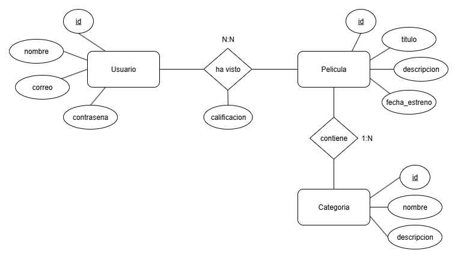
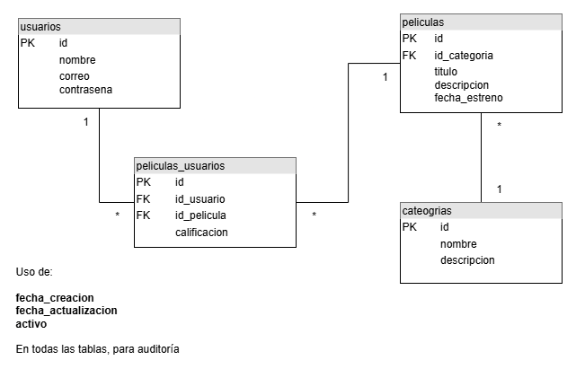
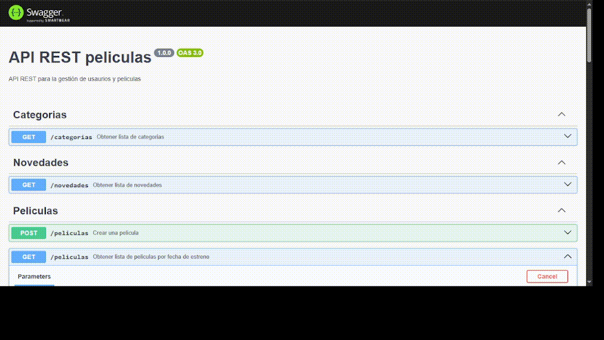
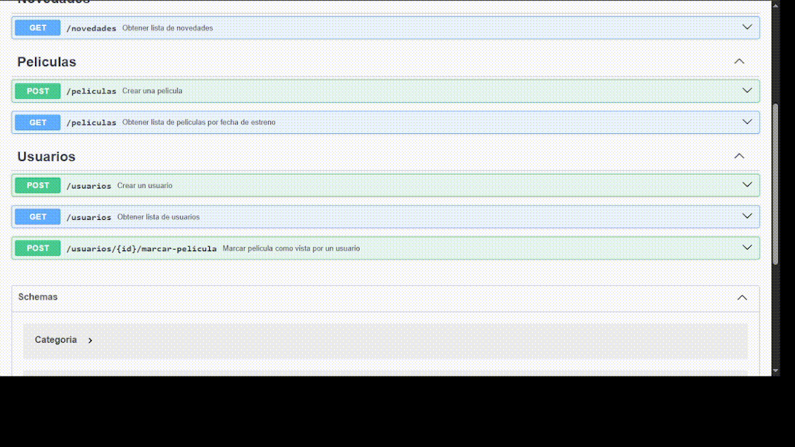
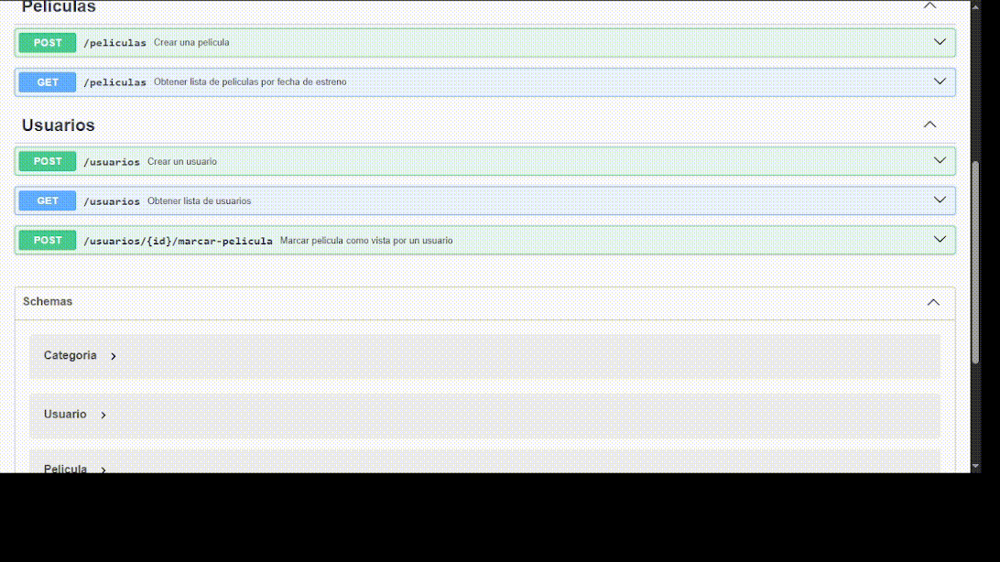
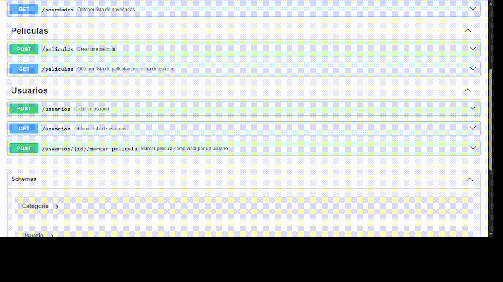

# Prueba Técnica – Backend Node.js

API REST para la gestión de usuarios, películas y categorías

## 🛠️ Instalación y Ejecución

A continuación se declaran los pasos para la instalación y ejecución de la API, tener en cuenta cada uno de los comandos:

1. **Clonar el repositorio**

    Clonar el repositorio
    ```bash
    git clone https://github.com/diegobauto/api-peliculas.git
    ```

    Ingresar a la carpeta clonada (al proyecto)
    ```bash
    cd api-peliculas
    ```

2. **Instalar dependencias**

    ```bash
    npm install
    ```

3. **Configurar variables de entorno**

    Crear archivo .env en la raíz del proyecto, usar de ejemplo:
    ```bash
    PORT=3000

    # Database
    PGHOST=localhost
    PGPORT=5432
    PGDATABASE=db_peliculas
    PGUSER=postgres
    PGPASSWORD=postgres
    ```

4. **Ejecutar archivo Docker Compose**

    Es necesario tener instalado Docker en tú maquina y ejecutando
    ```bash
    docker compose up -d
    ```

5. **Iniciar servidor**

    ```bash
    npm run dev
    ```

La API estará disponible en `http://localhost:3000/`

---

## 📖 Documentación API

### Acceso a la documentación

Una vez que el servidor esté ejecutándose, se accede a (se coloca en dicha ruta por practicidad):

- **Swagger UI**: `http://localhost:3000/`

---

## 📌 Endpoints

### Categorias

- `GET /categorias` - Obtener lista de categorias (precargadas)

### Novedades

- `GET /novedades` - Obtener lista de novedades

### Películas

- `POST /peliculas` - Crear una pelicula
- `GET /peliculas?page=1&limit=10` - Obtener lista de películas por fecha de estreno (paginación y filtros)

### Usuarios

- `POST /usuarios` - Crear un usuario
- `GET /usuarios` - Obtener lista de usuarios
- `POST /usuarios/{id}/marcar-pelicula` - Marcar película como vista por un usuario

---

## 📂 Estructura del Proyecto
Se uso arquitectura MVC con capas de Repository, Service y Controller.

```
src/
├── config/
│   └── swagger.js            # Configuración Swagger
├── controllers/              # Controladores HTTP
├── database/                 # Script SQL y poll de conexiones
├── middlewares/
│   ├── errorHandler.js       # Manejo centralizado de errores
│   └── validacion.js         # Validación con Joi
├── repositories/             # Lógica BD (Accesso a datos)
├── routes/                   # Definición de rutas
├── services/                 # Lógica de negocio
└── app.js                    # Punto de entrada principal
```

## 🗃️ Modelos

### Modelo ER (Entidad Relación)


### Modelo relacional


---

## 📖 Ejemplos de Uso (funcionamiento API)

- Obtener lista de categorias


- Crear una pelicula (reciente)


- Crear una pelicula (futura)


- Obtener lista de novedades


- Obtener lista de peliculas


- Crear un usuario


- Obtener lista de usuarios 


- Marcar pelicula como vista por un usuario


- Obtener lista de usuarios (mostrando películas vistas)

